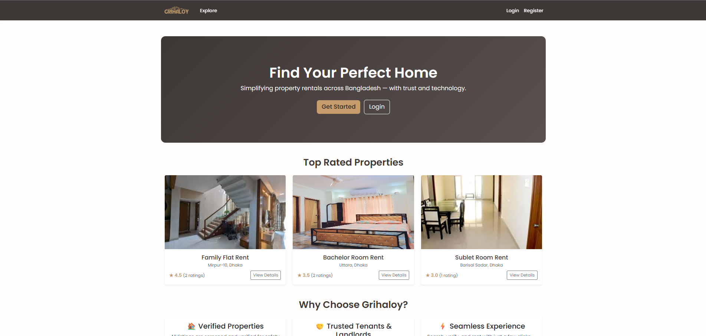

<h1 align="center">🏠 Grihaloy</h1>

  <b>A Smart Rental Management Platform for Bangladesh</b> 
  Simplifying property renting through modern web technology.

  
  
  
  

---

## 🌆 Overview

**Grihaloy** is a web-based platform that connects landlords and renters in Bangladesh.  
It provides a **streamlined rental process** — from registration to verification — through a secure and modern Django application.

> 🧱 Built with Django and Bootstrap for a clean, responsive experience.

---

## 🖼️ Project Preview

> *(Add your screenshot below — place it inside `static/images/`)*

  

---

## ✨ Key Features

✅ **User Authentication** — Login, registration, and role-based access (Admin, Landlord, Renter)  
✅ **Document Verification** — Landlords and renters can securely upload verification files  
✅ **Admin Control** — Manage users, roles, and verifications effortlessly  
✅ **Responsive Design** — Powered by Bootstrap 5 for a clean look on any device  
✅ **Future-Ready** — Planned modules for property management, payments, and notifications  

---

## 🧩 Tech Stack

| Category | Technology |
|-----------|-------------|
| **Backend Framework** | Django 5+ |
| **Language** | Python 3.10+ |
| **Frontend** | HTML5, CSS3, Bootstrap 5 |
| **Database** | SQLite (default) / PostgreSQL (optional) |
| **Authentication** | Django Auth System |

---

## 🏗️ Project Structure

grihaloy/
│
├── grihaloy/
│   ├── settings.py
│   ├── urls.py
│   └── wsgi.py
│
├── home/
│   ├── views.py
│   ├── urls.py
│   └── templates/home/
│       └── index.html
│
├── users/
│   ├── models.py
│   ├── forms.py
│   ├── views.py
│   └── templates/users/
│       ├── login.html
│       ├── register.html
│       ├── rating_form.html
│       └── verification_list.html
│
├── properties/
│   ├── models.py
│   ├── views.py
│   ├── routing.py
│   ├── consumers.py
│   └── templates/properties/
│       ├── property_list.html
│       ├── property_detail.html
│       ├── negotiation_chat.html
│       └── my_requests.html
│
├── static/
│   └── images/
│       └── logo.png
│
├── media/
│   ├── profile_pics/
│   └── property_photos/
│
├── templates/
│   └── base.html
│
├── requirements.txt
└── manage.py

